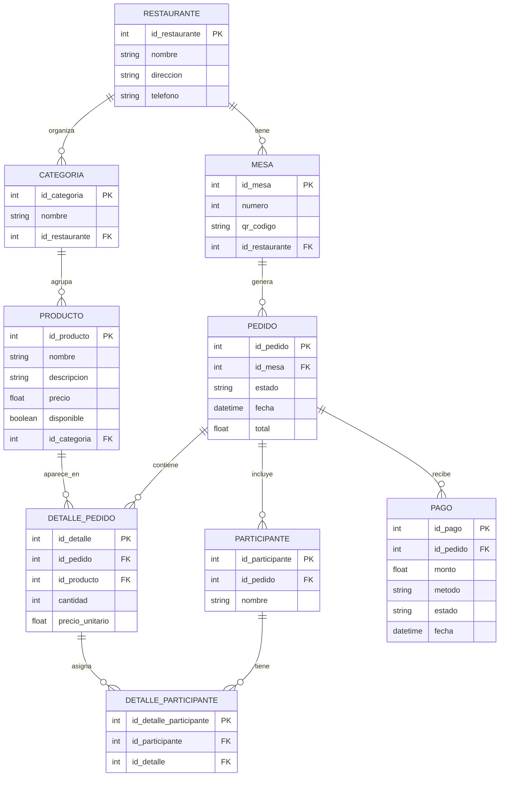

# Proyecto-desarrollo-de-

```mermaid
erDiagram

    RESTAURANTE {
        int id_restaurante PK
        string nombre
        string direccion
        string telefono
    }

    MESA {
        int id_mesa PK
        int numero
        string qr_codigo
        int id_restaurante FK
    }

    PEDIDO {
        int id_pedido PK
        int id_mesa FK
        string estado
        datetime fecha
        float total
    }

    DETALLE_PEDIDO {
        int id_detalle PK
        int id_pedido FK
        int id_producto FK
        int cantidad
        float precio_unitario
    }

    PRODUCTO {
        int id_producto PK
        string nombre
        string descripcion
        float precio
        boolean disponible
        int id_categoria FK
    }

    CATEGORIA {
        int id_categoria PK
        string nombre
        int id_restaurante FK
    }

    PARTICIPANTE {
        int id_participante PK
        int id_pedido FK
        string nombre
    }

    DETALLE_PARTICIPANTE {
        int id_detalle_participante PK
        int id_participante FK
        int id_detalle FK
    }

    PAGO {
        int id_pago PK
        int id_pedido FK
        float monto
        string metodo
        string estado
        datetime fecha
    }

    RESTAURANTE ||--o{ MESA : tiene
    RESTAURANTE ||--o{ CATEGORIA : organiza

    MESA ||--o{ PEDIDO : genera

    PEDIDO ||--o{ DETALLE_PEDIDO : contiene
    PEDIDO ||--o{ PARTICIPANTE : incluye
    PEDIDO ||--o{ PAGO : recibe

    CATEGORIA ||--o{ PRODUCTO : agrupa

    PRODUCTO ||--o{ DETALLE_PEDIDO : aparece_en

    PARTICIPANTE ||--o{ DETALLE_PARTICIPANTE : tiene
    DETALLE_PEDIDO ||--o{ DETALLE_PARTICIPANTE : asigna
```
